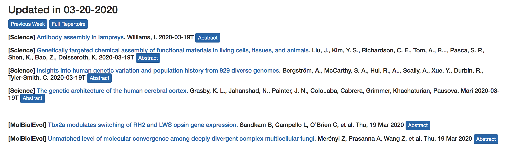

# TracingFrontline
Track the latest scientific publication via rss feeds and output in one single webpage.

##Dependency
* feedparser
* python3

## Basic usage

```bash
git clone https://github.com/lhui2010/TracingFrontline
pip install feedparser
#Test if it works
cd TracingFrontline
./table2html -o example_output/ 
```
Open the resulting html in your browser to see if it's OK.

```
open  example_output/rss.html
```

The output should be like :



In the example, example\_output is the output directory, so if you're using Apache, change it to:

```
./table2html -o /var/www/html
```

Normally, there should be two html files in output directory. One is rss-all.html which is the total 
rss result (Usually too long). So I usually filter them with my interested keywords and output
 rss.html file. You can change those keywords with -k. Use \| to seperate multiple keywords.

```
./table2html -o /var/www/html -k "genome\|sequence"
```


By default, the rss\_feeds will store in db/content.db and new feeds will keep adding to this database.
As time goes by, this file may be too long to read. So you can make an archive of current html pages and
 clear current database (Can't be undone)

```
./table2html -o /var/www/html -k "genome" --rotate
```

where the previous rss.html and rss-all.html will be renamed as `rss-03-20-2020.html`, `rss-all-03-20-2020.html`
and put in archive folder

```

### Add new rss feeds 
If you want mak a custom rss table, edit the table file and paste your journal name and RSS feeds seperated with space or tab.
If you have multiple rss feeds url for one journal, use ',' to seperate them

```
$vi table
Science http://science.sciencemag.org/rss/current.xml
Nature http://feeds.nature.com/nature/rss/current
NatBiotechnol http://www.nature.com/nbt/current_issue/rss/
MolBiolEvol https://academic.oup.com/rss/site_5325/3191.xml,https://academic.oup.com/rss/site_5325/advanceAccess_3191.xml,https://academic.oup.com/rss/site_5325/OpenAccess.xml
```

---

## Asset

### add\_hr.pl

Used to add a `<hr>` tag between adjacent differnt journals to seperate them.

###rss2table.py

rss2table.py is used to fromat rss links to tab seperated text files, input is `table` file

```bash
python rss2table.py rss_link_table >rss.table
```
### Output format

Column 1 was used for journal order
Column 2 was publication date
Column 3 was html format of this rss item
Use `cut -f3 rss.table >index.html` to get html file

```
000Science	20190314	<h5><b>[Science]</b> <a href=http://science.sciencemag.org/cgi/content/short/363/6432/1125?rss=1>Data sharing for pediatric cancers</a>. Vaske, O. M., Haussler, D. 2019-03-14T <button type="button" class="btn btn-primary btn-xs" data-toggle="collapse" data-target="#abstractDatasharingforpediatriccancers">Abstract</button></h5><div id="abstractDatasharingforpediatriccancers" class="collapse"></div> `
```

## CHANGELOG

### 2020年 03月 20日 星期五 10:55:03 CST
Update readme
Now support multiple rss for one journal
Also table2html.sh were largely re-written to ease use
